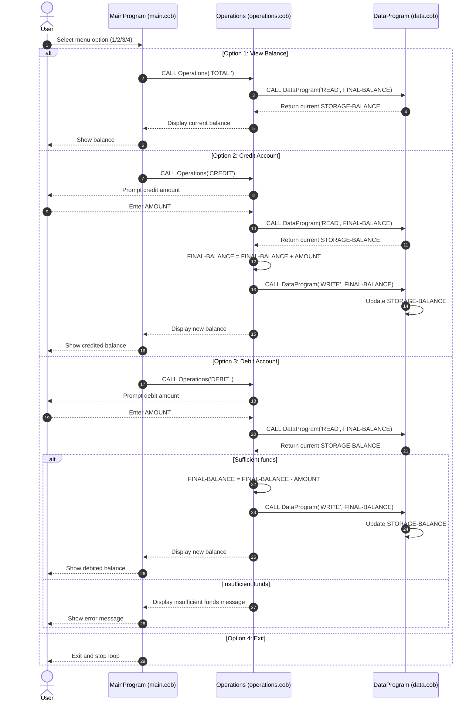

# COBOL Student Account System Documentation

This document explains the purpose of each COBOL source file, the key operations in each program, and the business rules currently enforced for student account handling.

## File Overview

### `src/cobol/main.cob` (`MainProgram`)
Purpose:
- Provides the console menu for the account system.
- Handles user interaction and routes requests to the operations layer.

Key logic:
- Displays a looped menu with options:
  1. View Balance
  2. Credit Account
  3. Debit Account
  4. Exit
- Calls `Operations` with an operation code:
  - `TOTAL ` for balance inquiry
  - `CREDIT` for adding funds
  - `DEBIT ` for subtracting funds
- Continues until the user selects Exit (`CONTINUE-FLAG = 'NO'`).

### `src/cobol/operations.cob` (`Operations`)
Purpose:
- Implements account business actions (view, credit, debit).
- Coordinates reading/writing the persisted balance through `DataProgram`.

Key logic:
- Accepts operation code from caller (`PASSED-OPERATION`).
- For `TOTAL `:
  - Reads current balance via `DataProgram` using `READ`.
  - Displays current balance.
- For `CREDIT`:
  - Prompts for credit amount.
  - Reads current balance.
  - Adds amount to balance.
  - Persists updated balance via `WRITE`.
- For `DEBIT `:
  - Prompts for debit amount.
  - Reads current balance.
  - Validates available funds.
  - Subtracts and persists if sufficient, otherwise displays an insufficient funds message.

### `src/cobol/data.cob` (`DataProgram`)
Purpose:
- Acts as the balance storage layer for the system.
- Encapsulates balance read/write behavior.

Key logic:
- Maintains `STORAGE-BALANCE` (initialized to `1000.00`).
- Receives operation mode and balance value via linkage parameters:
  - `READ`: move internal storage balance to caller’s `BALANCE` variable.
  - `WRITE`: update internal storage from caller’s `BALANCE` variable.

## Key Program Interfaces

### `Operations` input contract
- `PASSED-OPERATION` must be one of:
  - `TOTAL `
  - `CREDIT`
  - `DEBIT `

### `DataProgram` input contract
- Parameters (in order):
  1. Operation mode (`READ` or `WRITE`)
  2. Balance value (`PIC 9(6)V99`)

## Student Account Business Rules (Current Implementation)

1. **Single running account balance**
   - The system works with one active balance value at a time (no student ID/account partitioning in current code).

2. **Starting balance**
   - Initial balance is `1000.00`.

3. **Credit behavior**
   - Credits increase the current balance by the entered amount.

4. **Debit behavior with overdraft protection**
   - Debits are only allowed when `current balance >= debit amount`.
   - If funds are insufficient, the balance is unchanged.

5. **Persistence through program storage layer**
   - All balance reads/writes happen through `DataProgram` using explicit `READ`/`WRITE` operations.

6. **Operation code format sensitivity**
   - Operation values are fixed-length (`PIC X(6)`), including trailing spaces (for example, `TOTAL ` and `DEBIT `).
   - Callers must pass exact six-character values.

## Notes for Modernization

- Current implementation is menu-driven and synchronous.
- There is no input validation for negative values or non-numeric amounts in `AMOUNT`.
- There is no per-student account model yet; introducing student identifiers and record-based storage would be the next step for true student account support.

## Sequence Diagram (Data Flow)

